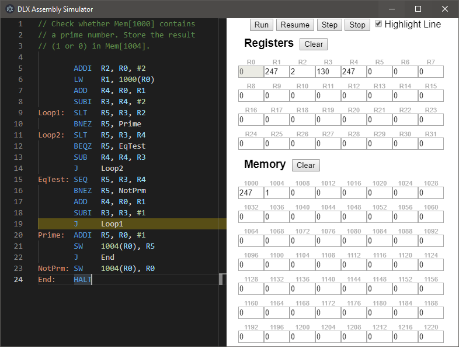

# DLX
A [DLX](https://en.wikipedia.org/wiki/DLX) assembly simulator running on Electron.

## To Use
* `npm install`
* `npm run start`

## Features
* Editor:
    * Syntax Highlighting
    * Code Completion
    * Jump to Definition
    * Basic refactoring (renaming)
* Interpreter:
    * Run, Step, Stop
    * Line highlighting, Breakpoints
* Storage view:
    * Multiple data formats (Decimal, Hex, Binary, ASCII, ...)
